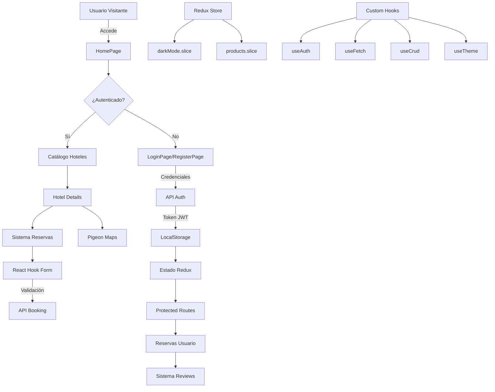

# 🏨 Hotel Booking App - React & Redux

Una aplicación completa de reservas de hoteles desarrollada con las tecnologías más modernas de React. Este proyecto demuestra un dominio avanzado del ecosistema React, incluyendo gestión de estado global, autenticación, formularios complejos, mapas interactivos y una arquitectura escalable.

## 🚀 Características Principales

- ✅ **Autenticación completa** (Login/Register/Logout)
- ✅ **Navbar dinámico según autenticación** (enlaces cambian si el usuario está logueado)
- 👤 **Página de perfil completa** con estadísticas, historial y configuración
- 🦶 **Footer profesional** con información del desarrollador y enlaces
- 🏨 **Catálogo de hoteles** con filtros y búsqueda
- 📍 **Mapas interactivos** con ubicaciones de hoteles
- 📅 **Sistema de reservas** con validación de fechas
- ⭐ **Sistema de reseñas** y calificaciones
- 🌓 **Modo oscuro/claro**
- 📱 **Diseño responsive**
- 🔒 **Rutas protegidas**
- 🎨 **Interfaz moderna** con FontAwesome y Boxicons

## 🛠️ Stack Tecnológico

### Frontend Core

- **React 19.1.0** - Biblioteca principal para UI
- **React DOM 19.1.0** - Renderizado en el DOM
- **React Router DOM 7.7.1** - Enrutamiento SPA
- **Vite 7.0.4** - Build tool y dev server ultra rápido

### Gestión de Estado

- **Redux Toolkit 2.8.2** - Gestión de estado global moderna
- **React Redux 9.2.0** - Conexión React-Redux

### Formularios y Validación

- **React Hook Form 7.62.0** - Formularios performantes y validación

### HTTP Client

- **Axios 1.11.0** - Cliente HTTP para API REST

### UI y Estilos

- **FontAwesome** - Iconos vectoriales
  - `@fortawesome/fontawesome-svg-core 7.0.1`
  - `@fortawesome/free-solid-svg-icons 7.0.1`
  - `@fortawesome/react-fontawesome 3.0.2`
- **Boxicons 2.1.4** - Librería de iconos adicional

### Mapas

- **Pigeon Maps 0.22.1** - Mapas interactivos ligeros para React

### Herramientas de Desarrollo

- **ESLint 9.30.1** - Linting y análisis de código
- **@vitejs/plugin-react 4.6.0** - Plugin de React para Vite
- **TypeScript** - Tipado estático
  - `@types/react 19.1.8`
  - `@types/react-dom 19.1.6`

## 🏗️ Arquitectura del Proyecto

```
src/
├── components/           # Componentes reutilizables
│   ├── Home/            # Componentes de página principal
│   ├── HotelDetailsPage/ # Componentes de detalles de hotel
│   ├── ReservationPage/ # Componentes de reservas
│   └── shared/          # Componentes compartidos
├── hooks/               # Custom hooks
│   ├── useAuth.js       # Hook de autenticación
│   ├── useCrud.js       # Hook CRUD genérico
│   ├── useFetch.js      # Hook para peticiones HTTP
│   └── useTheme.js      # Hook para tema oscuro/claro
├── pages/               # Páginas principales
│   ├── HomePage.jsx     # Página principal
│   ├── LoginPage.jsx    # Página de login
│   ├── RegisterPage.jsx # Página de registro
│   ├── HotelDetailsPage.jsx # Detalles de hotel
│   └── ReservationPage.jsx  # Página de reservas
├── services/            # Servicios y configuración
│   └── getConfigToken.js # Configuración de tokens JWT
├── store/               # Redux store
│   ├── index.js         # Configuración del store
│   └── slices/          # Redux slices
│       ├── darkMode.slice.js # Estado del tema
│       └── products.slice.js # Estado de productos/hoteles
└── styles/              # Archivos CSS
```

## 📊 Diagrama de Flujo de la Aplicación



## 🔌 API Endpoints Utilizados

**Base URL:** `https://hotels-api.academlo.tech`

### Autenticación

- `POST /users` - Registro de usuario
- `POST /users/login` - Inicio de sesión
- `GET /users/:id` - Obtener datos del usuario
- `PUT /users/:id` - Actualizar usuario
- `DELETE /users/:id` - Eliminar usuario

### Hoteles

- `GET /hotels` - Listar todos los hoteles
- `GET /hotels/:id` - Obtener detalles de hotel
- `GET /hotels?city=:cityId` - Hoteles por ciudad

### Reservas

- `GET /bookings` - Obtener reservas del usuario
- `POST /bookings` - Crear nueva reserva
- `DELETE /bookings/:id` - Cancelar reserva

### Reviews

- `GET /reviews?hotelId=:hotelId` - Reseñas de un hotel
- `POST /reviews` - Crear nueva reseña

## 🚀 Instalación y Uso

### Prerrequisitos

- Node.js 18+
- npm o yarn

### Instalación

```bash
# Clonar el repositorio
git clone https://github.com/React-js-paul/ent6-gen39bookApp.git

# Navegar al directorio
cd ent6-gen39bookApp

# Instalar todas las dependencias
npm install

# O instalar dependencias individuales
npm i react react-dom
npm i react-router-dom
npm i @reduxjs/toolkit react-redux
npm i axios
npm i react-hook-form
npm i @fortawesome/fontawesome-svg-core @fortawesome/free-solid-svg-icons @fortawesome/react-fontawesome
npm i boxicons
npm i pigeon-maps

# Dependencias de desarrollo
npm i -D vite @vitejs/plugin-react
npm i -D eslint @eslint/js eslint-plugin-react-hooks eslint-plugin-react-refresh
npm i -D @types/react @types/react-dom
npm i -D globals
```

### Comandos de Desarrollo

```bash
# Iniciar servidor de desarrollo
npm run dev

# Construir para producción
npm run build

# Ejecutar linter
npm run lint

# Previsualizar build de producción
npm run preview
```

## 🎯 Funcionalidades Técnicas Destacadas

### 1. **Gestión de Estado Global con Redux Toolkit**

- Store configurado con `configureStore`
- Slices para diferentes dominios (auth, hotels, theme)
- Middleware personalizado para manejo de tokens

### 2. **Custom Hooks Reutilizables**

- `useAuth`: Manejo completo de autenticación
- `useFetch`: Peticiones HTTP con loading y error states
- `useCrud`: Operaciones CRUD genéricas
- `useTheme`: Alternancia entre tema claro/oscuro

### 3. **Formularios Avanzados**

- Validación en tiempo real con React Hook Form
- Campos personalizados y validaciones complejas
- Manejo de errores y estados de carga

### 4. **Mapas Interactivos**

- Integración con Pigeon Maps
- Marcadores de ubicaciones de hoteles
- Navegación geográfica intuitiva

### 5. **Arquitectura de Componentes**

- Componentes funcionales con hooks
- Separación clara de responsabilidades
- Reutilización y composición

## 🔐 Autenticación y Seguridad

### 🧭 Navbar Dinámico

El componente de navegación (Header) muestra enlaces diferentes según el estado de autenticación:

- **Antes del login:**
  - Home
  - Register
  - Login
- **Después del login:**
  - Home
  - Mis Reservas
  - Perfil
  - Logout

El botón **Logout** elimina el token y los datos del usuario de localStorage y redirige al Home.

El navbar se actualiza automáticamente cuando el usuario inicia o cierra sesión.

#### Ejemplo visual:

| Estado         | Enlaces visibles                   |
| -------------- | ---------------------------------- |
| No autenticado | Home, Register, Login              |
| Autenticado    | Home, Mis Reservas, Perfil, Logout |

La autenticación se gestiona con hooks personalizados y localStorage, siguiendo buenas prácticas profesionales para apps React.

### 🦶 Footer Profesional

El footer incluye información completa sobre la aplicación y el desarrollador:

- **🏢 Información de la aplicación** - Descripción de AcademloHotels
- **🔗 Enlaces rápidos** - Navegación principal (Home, Reservas, Perfil, Login)
- **👨‍💻 Desarrollador** - Paul Zaruma (Freelance Full Stack Developer)
  - Email: jzaruma1209@gmail.com
  - Enlaces a redes profesionales (LinkedIn, GitHub, Portfolio, WhatsApp)
- **⚡ Tecnologías utilizadas** - Badges de React, Redux y Vite
- **📄 Copyright y créditos** - Información legal y reconocimientos

El footer es completamente responsive y se adapta al modo oscuro/claro.

### 🔐 Seguridad y Autenticación

- JWT tokens almacenados en localStorage
- Rutas protegidas con `ProtectedRoutes`
- Interceptores de Axios para inyección automática de tokens
- Manejo seguro de credenciales

### 👤 Página de Perfil Completa

La página de perfil incluye múltiples secciones con funcionalidades avanzadas:

- **📋 Información Personal**
  - Datos del usuario (nombre, email, género)
  - Formulario para editar información
  - Cambio de contraseña con validación
- **🏨 Historial de Reservas**
  - Lista de reservas pasadas y futuras
  - Estados de reservas (completada, confirmada, cancelada)
  - Detalles de cada reserva con precios
- **⭐ Mis Reseñas**
  - Reseñas escritas por el usuario
  - Calificaciones con sistema de estrellas
  - Historial de hoteles calificados
- **📊 Estadísticas Personales**
  - Número total de reservas
  - Gasto total en reservas
  - Ciudad favorita
  - Fecha de registro como miembro

#### 🔧 Endpoints de API Preparados

Todos los endpoints están preparados para cuando implementes tu propia API:

```javascript
// Estadísticas del usuario
GET /users/:id/stats

// Reseñas del usuario
GET /users/:id/reviews

// Historial de reservas del usuario
GET /users/:id/bookings/history

// Actualizar información personal
PUT /users/:id

// Cambiar contraseña
PUT /users/:id/change-password
```

Los datos se muestran con información de ejemplo mientras tanto, y cada funcionalidad tiene comentarios `TODO:` para facilitar la integración con tu API.

## 📱 Responsive Design

- Mobile-first approach
- Breakpoints optimizados
- Interfaz adaptable a todos los dispositivos
- Touch-friendly interactions

## 🌟 Rendimiento

- Code splitting con React.lazy
- Optimizaciones de Vite para build ultra-rápido
- Lazy loading de componentes
- Memoización con useMemo y useCallback

## 👨‍💻 Desarrollador

**Paulo** - Full Stack Developer

- Especialización en React y ecosistema moderno
- Experiencia con Redux Toolkit, React Router, y APIs REST
- Apasionado por las mejores prácticas y código limpio

---

## 📈 Próximas Mejoras

- [ ] Tests unitarios con Jest y React Testing Library
- [ ] Progressive Web App (PWA)
- [ ] Internacionalización (i18n)
- [ ] Cache de datos con React Query
- [ ] Notificaciones push
- [ ] Integración con pasarelas de pago

---

**¡Gracias por revisar este proyecto! 🚀**
